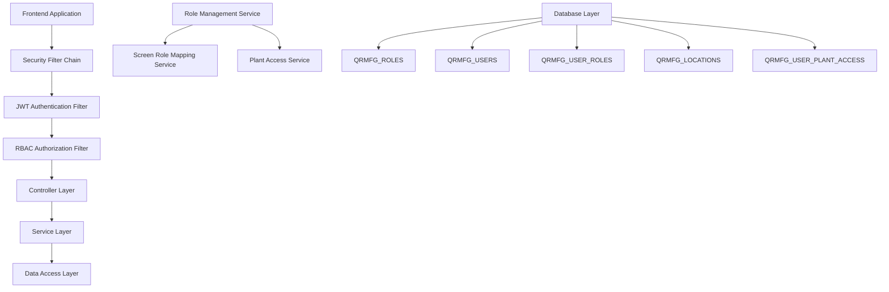
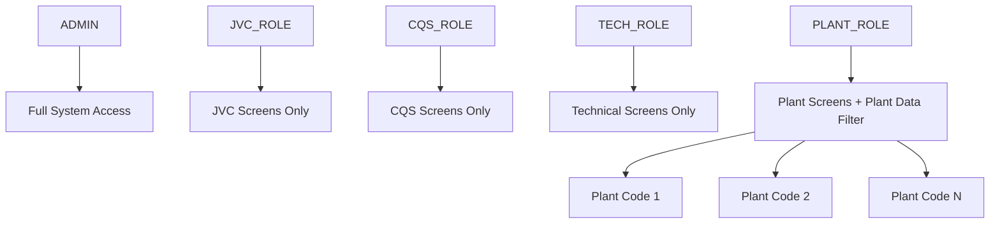

# Design Document

## Overview

The Role-Based Access Control (RBAC) system will be implemented as an enhancement to the existing Spring Security framework. The system will support five distinct roles with hierarchical access levels and specialized plant-based filtering for PLANT_ROLE users.

The design leverages the existing `QRMFG_ROLES`, `QRMFG_USERS`, and `QRMFG_USER_ROLES` tables while extending functionality to support plant-based data filtering and comprehensive access control.

## Architecture

### High-Level Architecture



### Role Hierarchy



## Components and Interfaces

### 1. Enhanced Role Management

#### RoleType Enum
```java
public enum RoleType {
    ADMIN("ADMIN", "Administrator with full access", true),
    JVC_ROLE("JVC_ROLE", "JVC operations access", false),
    CQS_ROLE("CQS_ROLE", "Quality system access", false),
    TECH_ROLE("TECH_ROLE", "Technical system access", false),
    PLANT_ROLE("PLANT_ROLE", "Plant operations access", true);
    
    private final String roleName;
    private final String description;
    private final boolean supportsPlantFiltering;
}
```

#### Enhanced Role Service Interface
```java
public interface RoleService {
    List<Role> getAllRoles();
    Role createRole(RoleType roleType, String description);
    void assignRoleToUser(Long userId, Long roleId);
    void removeRoleFromUser(Long userId, Long roleId);
    boolean hasRole(Long userId, RoleType roleType);
    List<String> getUserPlantCodes(Long userId);
    void assignPlantsToUser(Long userId, List<String> plantCodes);
}
```

### 2. Plant Access Management

#### PlantAccessService Interface
```java
public interface PlantAccessService {
    List<String> getAvailablePlantCodes();
    List<String> getUserAssignedPlants(Long userId);
    void assignPlantsToUser(Long userId, List<String> plantCodes);
    void removePlantsFromUser(Long userId, List<String> plantCodes);
    boolean hasPlantAccess(Long userId, String plantCode);
    String getUserPrimaryPlant(Long userId);
    void setPrimaryPlant(Long userId, String plantCode);
}
```

### 3. Enhanced Authorization Framework

#### RBACAuthorizationService Interface
```java
public interface RBACAuthorizationService {
    boolean hasScreenAccess(Authentication auth, String screenRoute);
    boolean hasDataAccess(Authentication auth, String dataType, Map<String, Object> context);
    List<String> getAccessibleScreens(Authentication auth);
    QueryFilter getDataFilter(Authentication auth, String entityType);
    void logAccessAttempt(Authentication auth, String resource, boolean granted);
}
```

#### Custom Authorization Annotations
```java
@Target({ElementType.METHOD, ElementType.TYPE})
@Retention(RetentionPolicy.RUNTIME)
public @interface RequireRole {
    RoleType[] value();
    boolean requireAll() default false;
}

@Target({ElementType.METHOD})
@Retention(RetentionPolicy.RUNTIME)
public @interface PlantDataFilter {
    String entityField() default "plantCode";
    boolean required() default true;
}
```

### 4. Data Filtering Framework

#### PlantDataFilter Interface
```java
public interface PlantDataFilter {
    <T> List<T> filterByPlantAccess(List<T> data, Authentication auth, String plantField);
    Specification<T> createPlantFilterSpecification(Authentication auth, String plantField);
    String buildPlantFilterQuery(Authentication auth, String plantField);
}
```

## Data Models

### Enhanced User Model Extensions
The existing `User` model already includes plant assignment fields:
- `assignedPlants`: JSON array of plant codes
- `primaryPlant`: Primary plant code

### New Plant Access Audit Model
```java
@Entity
@Table(name = "QRMFG_PLANT_ACCESS_AUDIT")
public class PlantAccessAudit {
    @Id
    private Long id;
    private Long userId;
    private String plantCode;
    private String action; // ASSIGNED, REMOVED, ACCESSED
    private LocalDateTime timestamp;
    private String performedBy;
}
```

### Screen Access Audit Model
```java
@Entity
@Table(name = "QRMFG_SCREEN_ACCESS_AUDIT")
public class ScreenAccessAudit {
    @Id
    private Long id;
    private Long userId;
    private String screenRoute;
    private String action; // ACCESSED, DENIED
    private LocalDateTime timestamp;
    private String ipAddress;
    private String userAgent;
}
```

## Error Handling

### Custom Exception Classes

```java
public class RBACException extends RuntimeException {
    private final String errorCode;
    private final String userMessage;
}

public class InsufficientRoleException extends RBACException {
    public InsufficientRoleException(String requiredRole, String userRole) {
        super("INSUFFICIENT_ROLE", 
              "Access denied. Required role: " + requiredRole + ", User role: " + userRole);
    }
}

public class PlantAccessDeniedException extends RBACException {
    public PlantAccessDeniedException(String plantCode) {
        super("PLANT_ACCESS_DENIED", 
              "Access denied to plant: " + plantCode);
    }
}
```

### Error Response Structure
```java
public class RBACErrorResponse {
    private String errorCode;
    private String message;
    private String userMessage;
    private LocalDateTime timestamp;
    private String requestPath;
    private List<String> allowedActions;
}
```

## Testing Strategy

### Unit Testing Approach

1. **Role Service Tests**
   - Role creation and assignment
   - Plant code assignment validation
   - Role hierarchy enforcement

2. **Authorization Service Tests**
   - Screen access validation
   - Data filtering logic
   - Plant-based access control

3. **Filter Integration Tests**
   - Security filter chain behavior
   - Authentication flow with roles
   - Authorization decision making

### Integration Testing

1. **End-to-End Role Scenarios**
   - ADMIN accessing all resources
   - JVC_ROLE restricted to JVC screens
   - CQS_ROLE restricted to CQS screens
   - TECH_ROLE restricted to technical screens
   - PLANT_ROLE with plant-specific data filtering

2. **Plant Access Testing**
   - Multi-plant user scenarios
   - Plant data filtering validation
   - Primary plant selection

3. **Security Testing**
   - Unauthorized access attempts
   - Role escalation prevention
   - Session management with roles

### Test Data Setup

```java
@TestConfiguration
public class RBACTestConfig {
    @Bean
    @Primary
    public RoleService mockRoleService() {
        // Mock implementation for testing
    }
    
    @Bean
    public List<TestUser> testUsers() {
        return Arrays.asList(
            new TestUser("admin", RoleType.ADMIN, null),
            new TestUser("jvc_user", RoleType.JVC_ROLE, null),
            new TestUser("plant_user", RoleType.PLANT_ROLE, Arrays.asList("PLANT001", "PLANT002"))
        );
    }
}
```

## Implementation Phases

### Phase 1: Core RBAC Infrastructure
- Enhanced role management service
- Basic authorization framework
- Screen access control
- Database schema updates

### Phase 2: Plant-Based Access Control
- Plant access service implementation
- Data filtering framework
- Plant assignment management
- PLANT_ROLE specific features

### Phase 3: Advanced Features
- Comprehensive audit logging
- Role-based menu filtering
- Advanced error handling
- Performance optimization

### Phase 4: Integration and Testing
- End-to-end testing
- Security validation
- Performance testing
- Documentation completion

## Security Considerations

### Authentication Integration
- Seamless integration with existing JWT authentication
- Role information cached in security context
- Session-based role validation

### Authorization Enforcement
- Method-level security annotations
- URL-based access control
- Data-level filtering

### Audit and Compliance
- Comprehensive access logging
- Role assignment audit trail
- Security event monitoring
- Compliance reporting capabilities

### Performance Optimization
- Role information caching
- Efficient database queries
- Lazy loading of plant assignments
- Query optimization for data filtering

## Configuration Management

### Application Properties
```properties
# RBAC Configuration
rbac.enabled=true
rbac.default-role=USER
rbac.admin-role=ADMIN
rbac.plant-filtering.enabled=true
rbac.audit.enabled=true
rbac.cache.ttl=3600

# Plant Access Configuration
plant.access.validation.enabled=true
plant.access.default-plant=MAIN
plant.access.multi-plant.enabled=true
```

### Role-Screen Mapping Configuration
```yaml
rbac:
  role-mappings:
    ADMIN:
      - "/dashboard"
      - "/workflows"
      - "/users"
      - "/roles"
      - "/admin/**"
    JVC_ROLE:
      - "/dashboard"
      - "/jvc/**"
    CQS_ROLE:
      - "/dashboard"
      - "/cqs/**"
    TECH_ROLE:
      - "/dashboard"
      - "/technical/**"
    PLANT_ROLE:
      - "/dashboard"
      - "/plant/**"
```

This design provides a comprehensive, scalable, and secure RBAC system that builds upon the existing infrastructure while adding the specialized features required for the five-role system with plant-based access control.